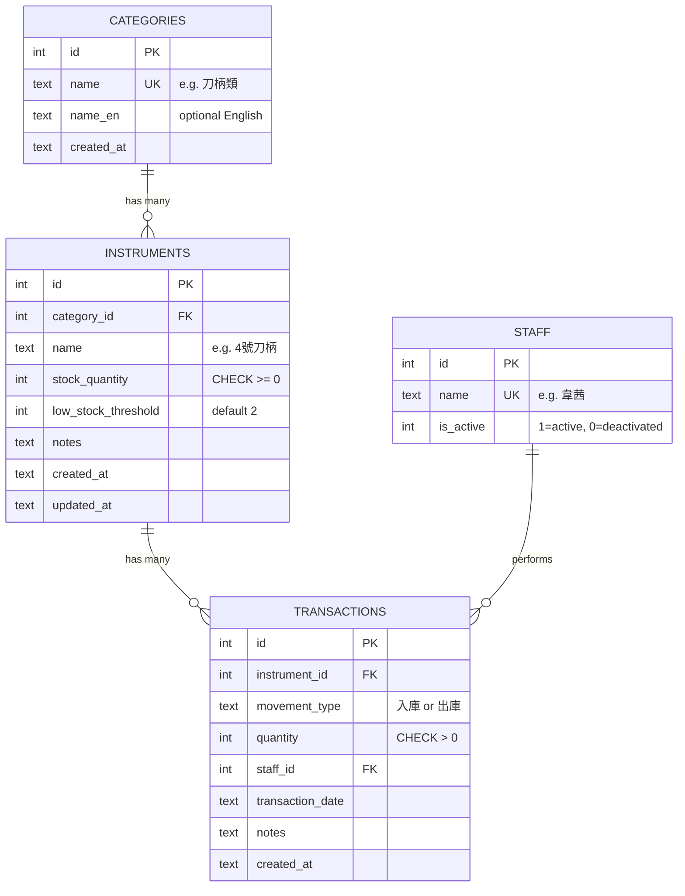
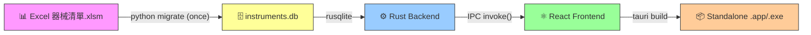

# 🏥 Hospital Instruments Inventory Management System — Design Plan

## Goal

Build a **lightweight, offline desktop application** to replace the current Excel-based workflow (`器械清單.xlsm`) for managing surgical instrument inventory at a hospital. The app uses **SQLite** as its embedded database, supports full CRUD operations, provides low-stock alerts, and exports data to CSV.

---

## User Review Required

> [!IMPORTANT]
> **Tech Stack Decision**: The plan recommends **Tauri v2 + React + TypeScript** as the primary stack. This requires the **Rust toolchain** on your development machine. If your team is Python-only, an alternative **PyQt6 + SQLite3** path is provided. Please confirm which direction you'd like to go.

> [!IMPORTANT]
> **SQLite Integration Approach**: Within Tauri, there are two paths:
> - **Option A: `tauri-plugin-sql`** — simplest, uses `sqlx` under the hood, allows SQL from frontend. Best for rapid development.
> - **Option B: Custom Rust backend with `rusqlite`** — full control, type-safe commands, better for complex business logic.
> 
> The plan uses **Option B (rusqlite)** for the atomic transaction safety required by inventory management. Please confirm.

> [!WARNING]
> **Data Migration**: The existing `.xlsm` file has a non-standard layout (4 parallel column groups in the inventory sheet). The migration script handles this, but the Excel file name in the project folder (`器械清單 .xlsm` — note the space before `.xlsm`) differs from what's referenced in the design doc (`器械清單_.xlsm`). We'll need to match the actual filename.

---

## 1. Excel File Analysis Summary

Based on analysis of the `器械清單.xlsm` file, three worksheets were identified:

| Sheet | Purpose | Migrated? |
|---|---|---|
| **介面 (Interface)** | Excel UI shell — login/date/staff selector | ❌ No (UI layer only) |
| **庫存 (Inventory)** | Live stock list — 4 parallel column groups | ✅ Yes → `instruments` + `categories` |
| **資料庫 (Database)** | Sequential in/out movement ledger | ✅ Yes → `transactions` + `staff` |

### Key Statistics
| Metric | Value |
|---|---|
| Total instrument SKUs | **203** |
| Instruments with zero stock | **53** (≈26%) |
| Instrument categories | **18** |
| Staff members | **9** |
| Existing transactions | **155** (initial batch dated 2026-02-10) |

### 18 Categories
`刀柄類`, `鑷子類`, `suction類`, `剪刀類`, `基本器械類`, `NＨ類`, `骨科撐開器`, `外科撐開器`, `Rongeur`, `Elevator`, `DiscRongeur`, `Punch`, `Cutter`, `Reduction`, `Osteotome`, `Currette`, `boneimpactor`, `其他`

---

## 2. Tech Stack Recommendation

### Comparison Matrix

| Criterion | Tauri v2 + React | Electron + React | PyQt6 + SQLAlchemy | CustomTkinter |
|---|---|---|---|---|
| **Bundle size** | ✅ 5–15 MB | ❌ 80–150 MB | ✅ ~25 MB | ✅ ~15 MB |
| **Startup speed** | ✅ Fast | ❌ Slow | ✅ Fast | ✅ Fast |
| **UI flexibility** | ✅ Full HTML/CSS | ✅ Full HTML/CSS | ⚠️ Qt widgets | ❌ Limited |
| **CJK / Chinese text** | ✅ Native WebView | ✅ Chromium | ⚠️ Font config needed | ⚠️ Font config needed |
| **SQLite integration** | ✅ rusqlite (sync) | ✅ better-sqlite3 | ✅ SQLAlchemy | ✅ stdlib sqlite3 |
| **Build complexity** | ⚠️ Rust toolchain | ✅ npm only | ✅ pip only | ✅ pip only |
| **Data grid quality** | ✅ TanStack Table | ✅ AG Grid / TanStack | ✅ QTableWidget | ❌ No built-in |
| **Packaging** | ✅ `tauri build` | ✅ electron-builder | ✅ PyInstaller | ✅ PyInstaller |

### ✅ Recommended: **Tauri v2 + React + TypeScript + rusqlite**

**Why this stack for a hospital environment:**

1. **Tiny footprint** (~10 MB) — hospital computers are often older, locked-down machines
2. **Perfect Chinese rendering** — native WebView handles CJK without font configuration
3. **Security-first** — Tauri's capability-based permission model restricts what the frontend can access
4. **Atomic transactions** — rusqlite gives full control over SQLite transactions for safe stock updates
5. **Rich data grid** — TanStack Table provides sorting, filtering, pagination with full CSS customization
6. **Single executable** — `tauri build` produces a standalone `.app` (macOS) / `.msi` (Windows) / `.AppImage` (Linux)

### 🥈 Runner-up: **PyQt6 + SQLite3 + PyInstaller**
If the team is Python-only. PyQt6's `QTableWidget` handles large datasets well with a native UI.

---

## 3. Database Schema Design

### Entity Relationship Diagram



### SQL Schema

```sql
-- TABLE: categories
CREATE TABLE categories (
    id        INTEGER PRIMARY KEY AUTOINCREMENT,
    name      TEXT NOT NULL UNIQUE,
    name_en   TEXT,
    created_at TEXT DEFAULT (datetime('now'))
);

-- TABLE: staff
CREATE TABLE staff (
    id         INTEGER PRIMARY KEY AUTOINCREMENT,
    name       TEXT NOT NULL UNIQUE,
    is_active  INTEGER NOT NULL DEFAULT 1
);

-- TABLE: instruments
CREATE TABLE instruments (
    id                  INTEGER PRIMARY KEY AUTOINCREMENT,
    category_id         INTEGER NOT NULL REFERENCES categories(id) ON DELETE RESTRICT,
    name                TEXT NOT NULL,
    stock_quantity      INTEGER NOT NULL DEFAULT 0 CHECK (stock_quantity >= 0),
    low_stock_threshold INTEGER NOT NULL DEFAULT 2,
    notes               TEXT,
    created_at          TEXT DEFAULT (datetime('now')),
    updated_at          TEXT DEFAULT (datetime('now')),
    UNIQUE (category_id, name)
);

-- TABLE: transactions (append-only ledger)
CREATE TABLE transactions (
    id               INTEGER PRIMARY KEY AUTOINCREMENT,
    instrument_id    INTEGER NOT NULL REFERENCES instruments(id) ON DELETE RESTRICT,
    movement_type    TEXT NOT NULL CHECK (movement_type IN ('入庫', '出庫')),
    quantity         INTEGER NOT NULL CHECK (quantity > 0),
    staff_id         INTEGER REFERENCES staff(id) ON DELETE SET NULL,
    transaction_date TEXT NOT NULL DEFAULT (date('now')),
    notes            TEXT,
    created_at       TEXT DEFAULT (datetime('now'))
);

-- INDEXES
CREATE INDEX idx_instruments_category   ON instruments(category_id);
CREATE INDEX idx_instruments_stock      ON instruments(stock_quantity);
CREATE INDEX idx_transactions_instrument ON transactions(instrument_id);
CREATE INDEX idx_transactions_date      ON transactions(transaction_date);
CREATE INDEX idx_transactions_staff     ON transactions(staff_id);

-- VIEW: Inventory summary for the main grid
CREATE VIEW v_inventory_summary AS
SELECT
    i.id,
    c.name        AS category,
    i.name        AS instrument_name,
    i.stock_quantity,
    i.low_stock_threshold,
    CASE WHEN i.stock_quantity = 0 THEN 'out_of_stock'
         WHEN i.stock_quantity <= i.low_stock_threshold THEN 'low_stock'
         ELSE 'ok'
    END AS stock_status,
    i.updated_at
FROM instruments i
JOIN categories c ON c.id = i.category_id;

-- VIEW: Transaction log with resolved names
CREATE VIEW v_transaction_log AS
SELECT
    t.id, t.transaction_date, c.name AS category,
    i.name AS instrument_name, t.movement_type,
    t.quantity, s.name AS staff_name, t.notes, t.created_at
FROM transactions t
JOIN instruments i  ON i.id = t.instrument_id
JOIN categories c   ON c.id = i.category_id
LEFT JOIN staff s   ON s.id = t.staff_id
ORDER BY t.id DESC;
```

### Key Design Decisions
- **`stock_quantity` on `instruments`** — updated atomically with each transaction; avoids SUM over entire ledger on every read
- **`transactions` is append-only** — never update/delete rows; preserves full audit trail
- **`CHECK (stock_quantity >= 0)`** — prevents negative stock at DB level
- **Per-instrument `low_stock_threshold`** — high-demand items can have higher alert thresholds

---

## 4. Architecture & Data Flow

### High-Level Architecture

```
┌──────────────────────────────────────────────────────────────┐
│                     Tauri v2 Desktop Shell                    │
│                                                              │
│  ┌────────────────────────────────────────┐                  │
│  │       React Frontend (WebView)         │                  │
│  │                                        │                  │
│  │  ┌──────────┐ ┌────────┐ ┌──────────┐ │                  │
│  │  │Inventory │ │ Stock  │ │ Reports  │ │                  │
│  │  │  Grid    │ │Movement│ │ & Export │ │                  │
│  │  └────┬─────┘ └───┬────┘ └────┬─────┘ │                  │
│  │       │           │           │        │                  │
│  │  ┌────▼───────────▼───────────▼─────┐  │                  │
│  │  │     TanStack Query (cache)       │  │                  │
│  │  │   + Tauri invoke() IPC Bridge    │  │                  │
│  │  └──────────────┬───────────────────┘  │                  │
│  └─────────────────┼──────────────────────┘                  │
│                    │ Rust Commands (IPC)                      │
│  ┌─────────────────▼──────────────────────┐                  │
│  │        Rust Backend (src-tauri)         │                  │
│  │                                        │                  │
│  │  ┌──────────────┐  ┌────────────────┐  │                  │
│  │  │  rusqlite    │  │  CSV Exporter  │  │                  │
│  │  │  (DB layer)  │  │  (csv crate)   │  │                  │
│  │  └──────┬───────┘  └───────┬────────┘  │                  │
│  └─────────┼──────────────────┼───────────┘                  │
│            │                  │                               │
│  ┌─────────▼──────────────────▼───────────┐                  │
│  │         instruments.db (SQLite)         │                  │
│  │     ~/Library/Application Support/      │                  │
│  │         InstrumentInventory/            │                  │
│  └─────────────────────────────────────────┘                  │
└──────────────────────────────────────────────────────────────┘
```

### Tauri IPC Command Reference

| Command | Purpose | Returns |
|---|---|---|
| `get_inventory(filter)` | Query `v_inventory_summary` with category/name/status filters | `Vec<InstrumentRow>` |
| `get_instrument(id)` | Single instrument detail | `InstrumentDetail` |
| `create_instrument(payload)` | INSERT into instruments | `new_id` |
| `update_instrument(id, payload)` | UPDATE name, category, threshold | `()` |
| `soft_delete_instrument(id)` | SET is_active = 0 | `()` |
| `record_transaction(payload)` | **Atomic:** INSERT transaction + UPDATE stock | `new_id` |
| `get_transactions(filter)` | Query `v_transaction_log` with date range | `Vec<TransactionRow>` |
| `get_low_stock()` | SELECT WHERE stock_status != 'ok' | `Vec<InstrumentRow>` |
| `export_csv(type, dest_path)` | Query → CSV file with UTF-8 BOM | `()` |
| `get_categories()` | All categories | `Vec<Category>` |
| `get_staff()` | Active staff only | `Vec<StaffMember>` |

### CRUD Safety Model — Atomic Transaction Example

```
record_transaction(出庫, instrument=4號刀柄, qty=2)
    │
    ▼
BEGIN TRANSACTION
    │
    ├─ 1. SELECT stock_quantity FROM instruments WHERE id = ?
    │      → current_stock = 3
    │
    ├─ 2. CHECK: qty(2) <= current_stock(3) → ✅ Pass
    │
    ├─ 3. INSERT INTO transactions(...) VALUES (...)
    │
    ├─ 4. UPDATE instruments SET stock_quantity = stock_quantity - 2
    │      → new_stock = 1
    │
    └─ COMMIT (all-or-nothing)
         │
         ▼
    Return success → Frontend refreshes grid
```

**Safety guarantees:**
- `PRAGMA journal_mode = WAL` — concurrent reads during writes
- `PRAGMA foreign_keys = ON` — referential integrity enforced  
- `CHECK (stock_quantity >= 0)` — catches logic errors at DB level
- Soft-delete for instruments — never hard-delete SKUs with transaction history

### CSV Export Flow

```
User clicks "Export CSV" → Select export type → OS Save Dialog
    │
    ▼
Rust handler:
  1. Query v_inventory_summary (or v_transaction_log with date filter)
  2. Write UTF-8 BOM (0xEF 0xBB 0xBF) → ensures Excel reads Chinese correctly
  3. Stream rows to csv crate writer
  4. Save to user-chosen path
    │
    ▼
Frontend shows success toast: "已匯出 203 筆"
```

**Export modes:**
1. **Inventory Snapshot** — current state of all instruments
2. **Transaction Log** — full or date-filtered ledger
3. **Low Stock Report** — only items below threshold

---

## 5. UI/UX Layout Design

### Application Shell

```
┌──────────────────────────────────────────────────────────────────┐
│  🏥 器械庫存管理系統         [🔍 搜尋___________]    👤 韋茜 ▼    │
├──────────┬───────────────────────────────────────────────────────┤
│          │                                                       │
│ 📦 庫存   │              MAIN CONTENT AREA                       │
│ 📋 出入庫 │                                                       │
│ ⚠️ 低庫存  │                                                       │
│ 📊 報表   │                                                       │
│ ⚙️ 設定   │                                                       │
│          │                                                       │
└──────────┴───────────────────────────────────────────────────────┘
```

### Screen 1: 📦 庫存 (Inventory Grid)

```
┌──────────────────────────────────────────────────────────────────┐
│ 庫存管理                            [+ 新增器械]  [↓ 匯出 CSV]    │
│                                                                   │
│ 篩選: [全部類別 ▼]  [全部狀態 ▼]  [搜尋器械名稱...]              │
│                                                                   │
│ ┌──────────────────────────────────────────────────────────────┐  │
│ │ ☐ │ 類別    │ 器械名稱             │ 庫存 │ 狀態   │ 操作    │  │
│ ├───┼─────────┼──────────────────────┼──────┼────────┼─────────┤  │
│ │ ☐ │ 刀柄類  │ 4號刀柄              │  1   │ ⚠️ 低   │ ✏️ 📋   │  │
│ │ ☐ │ 刀柄類  │ 3號刀柄              │  4   │ ✅ 正常 │ ✏️ 📋   │  │
│ │ ☐ │ 鑷子類  │ 5吋smooth forcepes   │  0   │ 🔴 缺貨 │ ✏️ 📋   │  │
│ │ ☐ │ 鑷子類  │ 7吋teeth forcepes    │  7   │ ✅ 正常 │ ✏️ 📋   │  │
│ └──────────────────────────────────────────────────────────────┘  │
│                                       顯示 1-20 / 203 筆         │
│                                 [< 上頁]  1 2 3 ...  [下頁 >]    │
└──────────────────────────────────────────────────────────────────┘
```

**Features:**
- Column sorting (click header to toggle asc/desc)
- Row highlighting: 🟡 amber for low stock, 🔴 red for zero stock
- ✏️ opens inline edit drawer | 📋 quick stock-in/out

### Screen 2: 📋 出入庫 (Stock Movement Entry)

```
┌──────────────────────────────────────────────────────────────────┐
│ 登記出入庫                                                         │
│                                                                   │
│  類型:    ● 入庫    ○ 出庫                                        │
│                                                                   │
│  類別:    [刀柄類                    ▼]                            │
│  器械:    [4號刀柄                   ▼]   現有庫存: 1              │
│  數量:    [  1  ▲▼]                                               │
│  日期:    [2026-03-28               📅]   (預設今日)               │
│  登記人:  [韋茜                      ▼]                            │
│  備註:    [_________________________________]                      │
│                                                                   │
│                              [取消]  [✅ 確認登記]                  │
└──────────────────────────────────────────────────────────────────┘
```

**Validation rules:**
- 出庫 quantity cannot exceed current stock (real-time inline error)
- Instrument dropdown auto-filters by selected category
- All required fields highlighted on submit if empty

### Screen 3: ⚠️ 低庫存警示 (Low Stock Alerts)

```
┌──────────────────────────────────────────────────────────────────┐
│ ⚠️ 低庫存警示                      53 項缺貨 / 12 項低庫存         │
│                                                                   │
│ 🔴 缺貨 (0件)                                                    │
│  ┌─────────────────────────────────────────────────────────────┐  │
│  │ • 刀柄類 → 5吋smooth forcepes              [+ 快速補貨]     │  │
│  │ • 鑷子類 → Addison teeth forcepes          [+ 快速補貨]     │  │
│  │ • ...                                                       │  │
│  └─────────────────────────────────────────────────────────────┘  │
│                                                                   │
│ ⚠️ 低庫存 (≤ 閾值)                                                │
│  ┌─────────────────────────────────────────────────────────────┐  │
│  │ • 刀柄類 → 4號刀柄      庫存: 1 / 閾值: 2  [+ 快速補貨]     │  │
│  │ • ...                                                       │  │
│  └─────────────────────────────────────────────────────────────┘  │
└──────────────────────────────────────────────────────────────────┘
```

**「快速補貨」** button pre-fills the stock movement form with `入庫` + selected instrument.

### Screen 4: 📊 報表 / CSV 匯出

```
┌──────────────────────────────────────────────────────────────────┐
│ 匯出報表                                                          │
│                                                                   │
│  匯出類型:                                                        │
│  ● 庫存快照 (目前所有器械庫存)                                     │
│  ○ 出入庫記錄 (指定日期範圍)                                      │
│     起始日期: [2026-02-01]   結束日期: [2026-03-28]               │
│  ○ 低庫存清單                                                     │
│                                                                   │
│  預覽 (前 5 筆):                                                  │
│  ┌──────────────────────────────────────────────────────────┐     │
│  │ 類別, 器械名稱, 庫存, 狀態                               │     │
│  │ 刀柄類, 4號刀柄, 1, 低庫存                               │     │
│  │ ...                                                      │     │
│  └──────────────────────────────────────────────────────────┘     │
│                                                                   │
│                        [取消]  [選擇儲存位置並匯出 ↓]              │
└──────────────────────────────────────────────────────────────────┘
```

### Screen 5: ⚙️ 設定 (Settings)

- **Staff management** — add/deactivate personnel
- **Category management** — add/rename categories
- **Low-stock threshold** — batch adjust thresholds
- **Database backup** — manual backup/restore
- **About** — version info

---

## 6. Data Migration Strategy

### One-Time Python Script

```
器械清單.xlsm  ──→  migrate_xlsm_to_sqlite.py  ──→  instruments.db
```

**Dependencies:** `pip install pandas openpyxl`

**Process:**
1. Parse `庫存` sheet → extract 4 parallel column groups → seed `categories` (18) + `instruments` (203)
2. Parse `資料庫` sheet → seed `staff` (9) + `transactions` (155)
3. Uses `INSERT OR IGNORE` — idempotent, safe to re-run

> [!NOTE]
> The migration script from the existing design document is ready to use. It correctly handles the non-standard 4-column-group layout in the inventory sheet. Only the filename needs to be updated to match the actual file.

---

## 7. MVP Implementation Roadmap

### Phase 0 — Environment Setup (Day 1)

| Task | Command |
|---|---|
| Install Node.js 20+ | `brew install node` |
| Install Rust toolchain | `curl --proto '=https' --tlsv1.2 -sSf https://sh.rustup.rs \| sh` |
| Install Tauri CLI | `cargo install tauri-cli` |
| Create project | `npm create tauri-app@latest instrument-inventory` (React + TS) |
| Install dependencies | `npm install @tanstack/react-table @tanstack/react-query react-hook-form zod lucide-react` |
| Install Tauri plugins | `npm run tauri add dialog` + `npm run tauri add fs` |

### Phase 1 — Database Layer (Days 1–2)
- [ ] Finalize `schema.sql` → place in `src-tauri/migrations/001_init.sql`
- [ ] Run Python migration script → produce seed `instruments.db`
- [ ] Implement `db.rs`: connection init, PRAGMA settings, migration runner
- [ ] Store connection in `State<Mutex<Connection>>`

### Phase 2 — Backend Commands (Days 2–4)
- [ ] `get_inventory`, `get_instrument` — read operations
- [ ] `create_instrument`, `update_instrument`, `soft_delete_instrument`
- [ ] `record_transaction` — atomic stock update
- [ ] `get_transactions` — with date range filter
- [ ] `get_low_stock` — alert query
- [ ] `export_csv` — with UTF-8 BOM
- [ ] `get_categories`, `get_staff`
- [ ] Unit tests with in-memory SQLite

### Phase 3 — Frontend (Days 4–8)
- [ ] `useInventory` hook — TanStack Query wrappers for all IPC calls
- [ ] `InventoryGrid` — TanStack Table with sorting, filtering, pagination, row highlighting
- [ ] `TransactionForm` — react-hook-form + zod, cascading dropdowns
- [ ] `LowStockAlerts` — filtered view with 快速補貨 shortcut
- [ ] `ExportPanel` — type selector, date pickers, preview table, OS save dialog
- [ ] Sidebar navigation + low-stock badge count
- [ ] i18n: wrap strings in `t()` helper for future language switching

### Phase 4 — Integration & Testing (Days 8–10)
- [ ] Rust unit tests (each command, in-memory DB)
- [ ] React component tests (Vitest + React Testing Library)
- [ ] E2E test: add instrument → stock-out → verify count → export CSV
- [ ] Edge cases: 出庫 > stock, CSV with Chinese, empty categories

### Phase 5 — Packaging & Deployment (Days 10–11)
- [ ] `npm run tauri build` → standalone executable
- [ ] DB stored in OS app data dir (not beside executable)
- [ ] First-run wizard: start fresh or import existing `.db`
- [ ] Auto-backup on startup (keep last 7 days)
- [ ] Code-signing for hospital IT compliance

### Project File Structure

```
instrument-inventory/
├── src/                           # React frontend
│   ├── components/
│   │   ├── InventoryGrid.tsx      # Main data grid
│   │   ├── TransactionForm.tsx    # Stock in/out form
│   │   ├── LowStockAlerts.tsx     # Alert dashboard
│   │   ├── ExportPanel.tsx        # CSV export UI
│   │   └── Sidebar.tsx            # Navigation
│   ├── hooks/
│   │   └── useInventory.ts        # TanStack Query + invoke()
│   ├── lib/
│   │   └── i18n.ts                # Translation helper
│   ├── App.tsx
│   └── main.tsx
├── src-tauri/
│   ├── src/
│   │   ├── main.rs                # Tauri entry point
│   │   ├── commands.rs            # All #[tauri::command] fns
│   │   └── db.rs                  # SQLite connection + queries
│   ├── migrations/
│   │   └── 001_init.sql           # Schema
│   ├── Cargo.toml                 # rusqlite, csv crate deps
│   └── tauri.conf.json            # App config, permissions
├── scripts/
│   └── migrate_xlsm_to_sqlite.py  # One-time migration
├── instruments.db                  # Generated seed database
└── package.json
```

---

## 8. Summary Flow



---

## Open Questions

> [!IMPORTANT]
> 1. **Tech stack confirmation**: Are you comfortable with the Rust toolchain requirement for Tauri, or would you prefer the PyQt6 alternative?
> 2. **Target platforms**: Will this run on macOS only, or also Windows/Linux hospital workstations?
> 3. **Multi-user**: Will multiple staff access the same database file (e.g., on a shared network drive), or is this single-user per machine?
> 4. **Barcode/RFID**: Any plans to integrate barcode scanners for instrument tracking?
> 5. **Authentication**: Does the app need login/password security, or is the staff dropdown sufficient?

---

## Verification Plan

### Automated Tests
- `cargo test` — Rust unit tests for all DB commands with in-memory SQLite
- `npx vitest` — React component tests for forms, tables, and validation
- Browser subagent E2E test — full workflow from stock-in to CSV export

### Manual Verification
- Run `python migrate_xlsm_to_sqlite.py` and verify 203 instruments + 155 transactions seeded
- Launch dev app with `npm run tauri dev` and test all 5 screens
- Export CSV and verify Chinese characters open correctly in Excel
- Test on target hospital workstation OS
